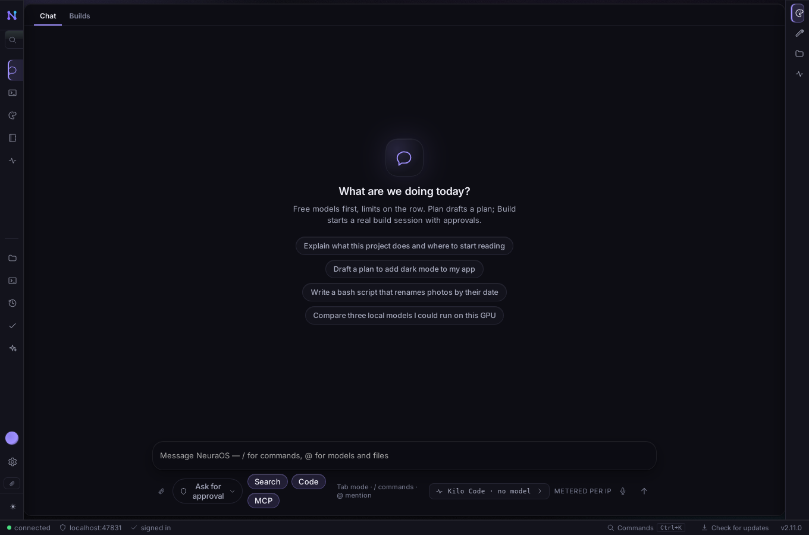
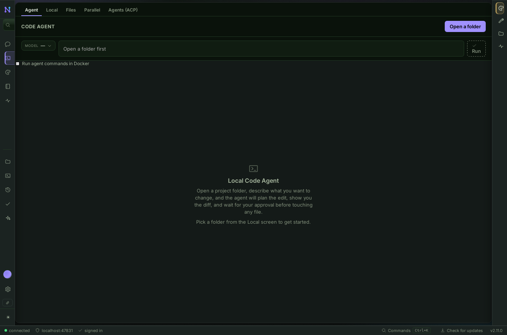
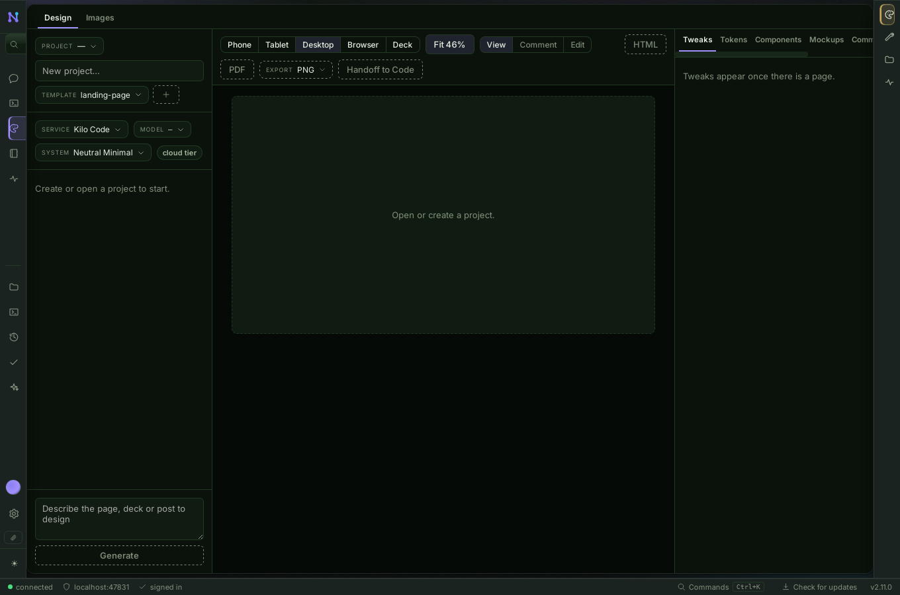
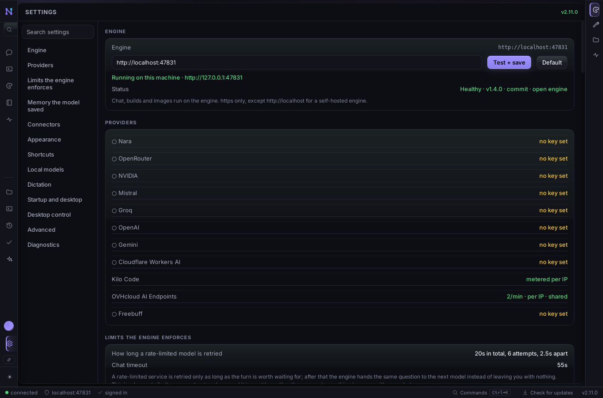
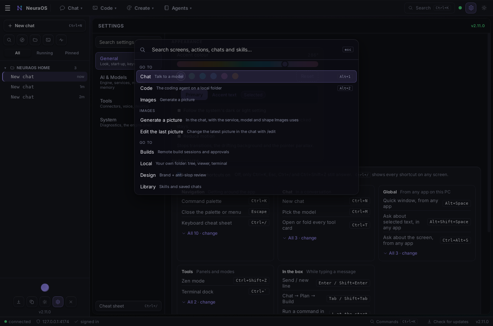
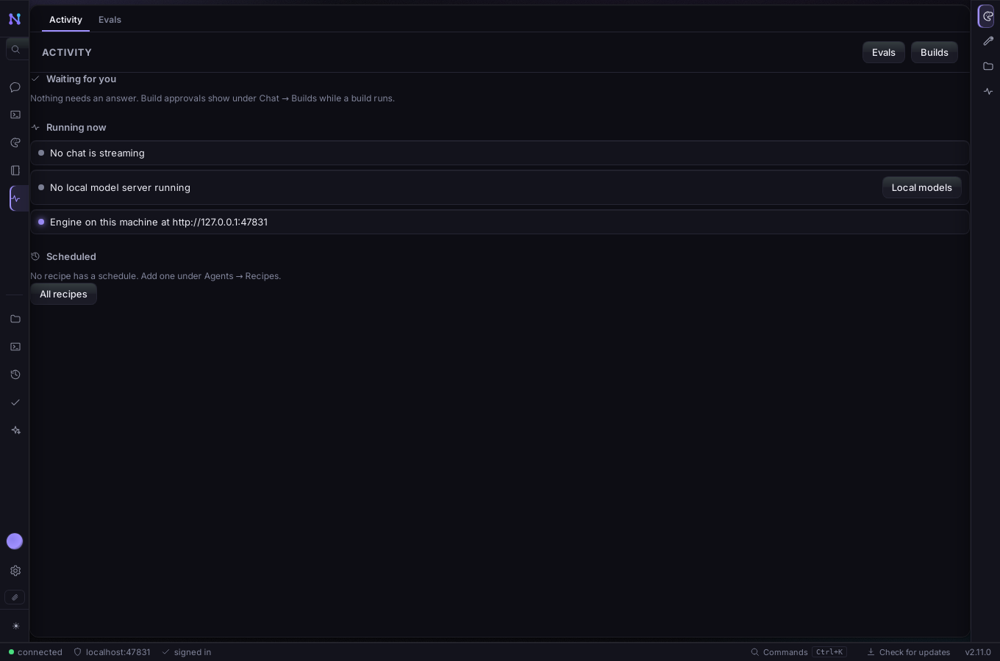
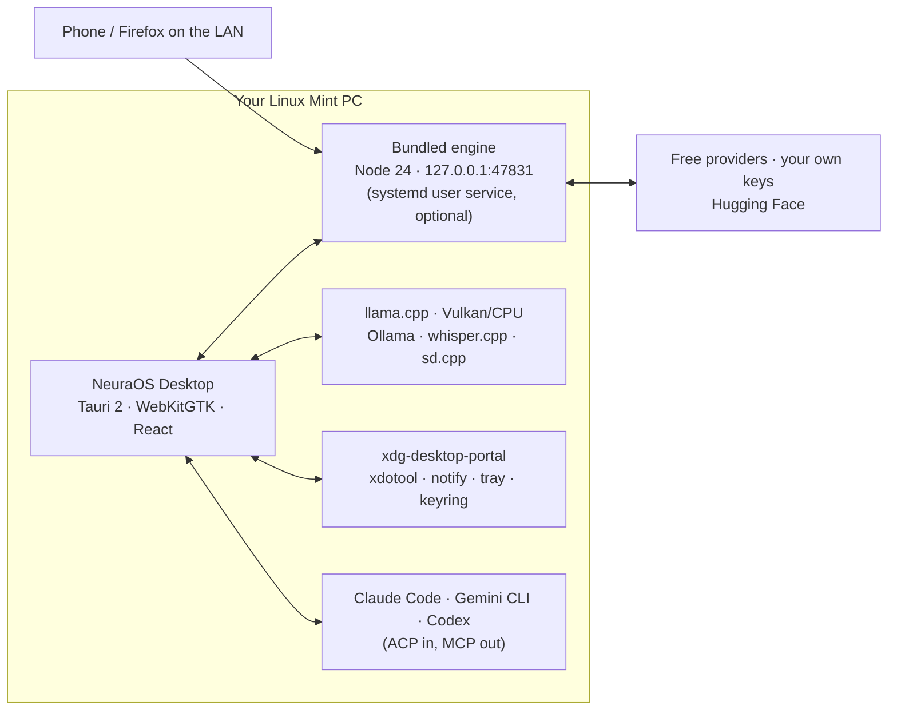

<p align="center">
  
</p>

<p align="center">
  <a href="https://github.com/tradernonymous/EzyNeura-NeuraOS-Linux-App/releases/latest"></a>
  <a href="https://github.com/tradernonymous/EzyNeura-NeuraOS-Linux-App/actions/workflows/linux.yml"></a>
  <a href="https://github.com/tradernonymous/EzyNeura-NeuraOS-Linux-App/releases"></a>
  
  
</p>

<p align="center">
  <b>The NeuraOS you know from the phone and the Windows app, native on Linux Mint.</b><br>
  Chat, code, create and run agents with free models, your own keys, or models on your own GPU — nothing has to leave the PC.<br>
  Same engine as the web app (<a href="https://github.com/tradernonymous/freeopenai">tradernonymous/freeopenai</a>), built for Cinnamon.
</p>

---

## Get it

<table>
<tr>
<td width="33%" valign="top">

### 📦 `.deb` — recommended
Download `neura-os-desktop_<version>_amd64.deb` from the **[latest release](https://github.com/tradernonymous/EzyNeura-NeuraOS-Linux-App/releases/latest)**, then:

```bash
sudo apt install ./neura-os-desktop_*_amd64.deb
```

NeuraOS shows up in the Mint menu. Updates arrive in the app.

</td>
<td width="33%" valign="top">

### 🧊 AppImage — portable
Any distro, no install, updates itself in place:

```bash
chmod +x NeuraOS-*-x86_64.AppImage
./NeuraOS-*-x86_64.AppImage
```

</td>
<td width="33%" valign="top">

### 🔁 apt repository — Update Manager
Once, then Mint keeps it current:

```bash
sudo install -d /etc/apt/keyrings
curl -fsSL https://tradernonymous.github.io/EzyNeura-NeuraOS-Linux-App/neuraos.gpg | sudo tee /etc/apt/keyrings/neuraos.gpg >/dev/null
echo 'deb [signed-by=/etc/apt/keyrings/neuraos.gpg] https://tradernonymous.github.io/EzyNeura-NeuraOS-Linux-App stable main' | sudo tee /etc/apt/sources.list.d/neuraos.list
sudo apt update && sudo apt install neura-os-desktop
```

</td>
</tr>
</table>

| | |
| :-- | :-- |
| **Runs on** | Linux Mint 21.x, 22.x and 23, Ubuntu 22.04 or newer, 64-bit (`amd64`). Built on Ubuntu 22.04 so the `.deb` works across all of them |
| **Needs** | `libwebkit2gtk-4.1-0`, `libgtk-3-0`, `libayatana-appindicator3-1`, `libdbus-1-3` (apt pulls them in). Recommended: `libvulkan1` for GPU models, `xdotool` for Voice Type and desktop control, `bubblewrap` for the light sandbox |
| **Updates** | A banner in the app offers each new release; one click installs it (the `.deb` through Mint's package installer, the AppImage in place). Or the apt repository above |
| **Uninstall** | `sudo apt remove neura-os-desktop` |

<details>
<summary><b>Try the newest build before it's released</b></summary>

Every push to `main` builds a `.deb` and an AppImage and smoke-tests the binary under a virtual display. Open the newest green [Linux workflow run](https://github.com/tradernonymous/EzyNeura-NeuraOS-Linux-App/actions/workflows/linux.yml), download the `neuraos-linux-<commit>` artifact (signed in to GitHub), then:

```bash
cd ~/Downloads
unzip -o neuraos-linux-*.zip
sudo apt install ./deb/*.deb
```

The zip holds `deb/` and `appimage/`, and the file names contain a space. The run's `neuraos-smoke-screenshot` artifact is what that build looks like on first start.
</details>

## A look

<table>
<tr>
<td width="50%"><br><sub><b>Chat</b> · free models first, a local model with one click, every tool behind an Allow card</sub></td>
<td width="50%"><br><sub><b>Code</b> · the local agent on your folder, parallel worktrees, and Claude Code / Gemini CLI / Codex over ACP</sub></td>
</tr>
<tr>
<td><br><sub><b>Create</b> · pages and pictures, previewed for phone, tablet, desktop and deck</sub></td>
<td><br><sub><b>Settings</b> · the engine on your machine, providers, local models, dictation, desktop control</sub></td>
</tr>
<tr>
<td><br><sub><b>Ctrl+K</b> · every screen, action, chat and skill, one box</sub></td>
<td><br><sub><b>Activity</b> · everything waiting for your OK, everything running, in one place</sub></td>
</tr>
</table>

<sub>Captured on the build under a virtual display (`scripts/screenshot-tour.sh`), no model connected — so the screens are honest empty states, not a demo. The same in daylight: <a href="docs/assets/screens/chat-light.png">light theme</a>.</sub>

## Four spaces, one orb

`Alt+1` to `Alt+4`, or the bar across the top: point at a space and its pages drop down. The column on the left is your projects and history (`Ctrl+B` hides it): every chat lives in a folder, and chats are listed by folder.

| Space | What lives there |
| :-- | :-- |
| 💬 **Chat** | Talk to a model. Plan drafts a plan; Build runs a real build session with approvals. `/screenshot`, `/recipe`, `@model`, `@file` |
| 🧑‍💻 **Code** | The local coding agent on a folder you open, files, a real terminal, parallel worktrees, and **Agents (ACP)**: Gemini CLI, Claude Code, Codex or any [Agent Client Protocol](https://agentclientprotocol.com) agent, inside NeuraOS's approvals |
| 🎨 **Create** | Design pages with tweaks, tokens, components and mockups; generate and edit pictures with a cloud model or stable-diffusion.cpp on your GPU |
| 🧩 **Agents** | Your library (skills, personas, prompts), saved agents, recipes and their schedules, and **Runs**: everything waiting for you or running |

The **orb** at the foot of the sidebar: click to dictate, hold for a new chat. It pulses while any agent works; the tray icon shows a cyan dot for the same, amber when something needs your OK. **Settings** is the gear in the top bar or `Ctrl+,`. **`Ctrl+K`** reaches everything.

## What Linux Mint gets

<table>
<tr>
<td width="50%" valign="top">

### 🖥️ Local models on your GPU
Settings → Local models shows your GPU, its memory and what size of model fits, then downloads the official llama.cpp build (Vulkan for NVIDIA, AMD and Intel, or CPU-only) into the app's own folder. No sudo. Ollama, an unzipped llama.cpp, whisper.cpp and sd.cpp are found wherever Linux installs put them.

### ⚙️ The engine on your machine
Settings → Engine downloads Node 24 (sha256-checked from nodejs.org) if Mint's is too old, runs the bundled engine on `127.0.0.1`, and can keep it running as a **systemd user service** after the window closes: Firefox at `127.0.0.1:47831` then shows the same NeuraOS, and your phone can reach it on the LAN.

### 🤝 Coding agents behind NeuraOS's approvals
Code → Agents (ACP) runs Gemini CLI, Claude Code, Codex or any ACP agent inside the open folder. Every file it wants to write and every permission it asks for is a card, and a desktop notification with **Allow / Reject** buttons, so you can keep working in another window.

### 🔌 NeuraOS as an MCP server
`freeai4u-desktop --mcp` lets Claude Code, Gemini CLI, Codex or any MCP client ask the models running on this machine (`neuraos_chat`), draw with the image server, list what the PC has and open a folder in NeuraOS. Settings → Connectors copies the `claude mcp add` line.

</td>
<td width="50%" valign="top">

### 🎙️ Voice Type
Hold `Ctrl+Alt+V` anywhere, speak, let go: the words are typed into VS Code, the terminal, the browser. Mint's answer to Win+H. whisper.cpp on your machine, or Hugging Face.

### 🖱️ Ask about the screen, act on the desktop
`Ctrl+Alt+S` in any app takes a screenshot into the chat. Settings → Desktop control lets a model take screenshots, click, type and press keys itself, each behind an Allow card: xdotool on X11, the RemoteDesktop portal on Wayland.

### 🔍 Ask about the selection
Highlight text in any app, press `Alt+Shift+Space`, and the Quick window opens with it. `Ctrl+Alt+Space` opens Quick empty.

### 🗂️ Nemo, tray, startup, sandbox
Right-click actions in Nemo (open a folder in NeuraOS Code, ask about a file, inspect a GGUF). Start at login into the tray. **bubblewrap** beside Docker and Podman for the commands an agent runs: no daemon, no image, no network.

### 🪟 Wayland-ready
Mint 23's Wayland session: screenshots, the global hotkeys and Voice Type go through xdg-desktop-portal; X11 stays the default path. Native Cinnamon titlebar, follows Mint's dark/light setting, secrets in your login keyring (Seahorse), reduce-motion respected.

</td>
</tr>
</table>

## How it fits together



Everything that changes something (a file, a command, a commit, a click on your desktop, an MCP tool) shows an Allow / Deny card first. Reading never asks.

## Build it yourself

```bash
sudo apt install libwebkit2gtk-4.1-dev libgtk-3-dev libayatana-appindicator3-dev \
  librsvg2-dev libsoup-3.0-dev libdbus-1-dev patchelf
cd app/desktop
npm install
npx tauri build --bundles deb,appimage
```

The `.deb` ends up in `app/desktop/src-tauri/target/release/bundle/deb/`. Checks a contributor runs: `npx tsc --noEmit`, `npm run build`, `node --test 'app/test/*.test.js'`, `cargo test --manifest-path app/desktop/src-tauri/Cargo.toml`, `scripts/screenshot-smoke-test.sh` for a headless look at the window and `scripts/screenshot-tour.sh` for the README's screens.

**Releasing:** a `v*` tag builds, signs and publishes the `.deb`, the AppImage and the update manifest, and rebuilds the apt repository on GitHub Pages ([packaging/release/README.md](packaging/release/README.md)).

## Plan and status

[docs/MASTER_PLAN.md](docs/MASTER_PLAN.md): the porting audit, design, architecture, phases L0–L9 and what you do yourself. [docs/BACKLOG.md](docs/BACKLOG.md): what each phase has landed, what was verified where, and what still needs a real Mint machine.
