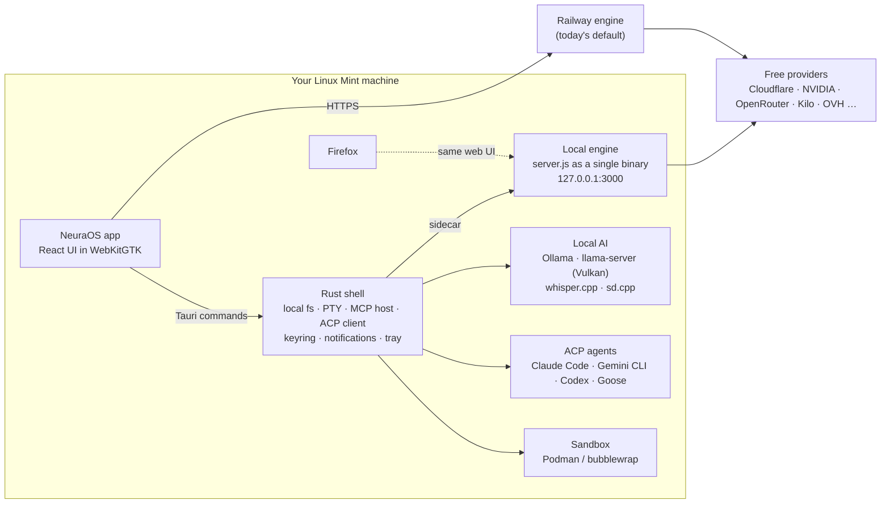

# NeuraOS for Linux Mint: master plan

Written 2026-09-23. Based on reading `tradernonymous/freeopenai` at `8bbfffa`,
including the web app, the Android app (`android/`) and the desktop app
(`desktop/`), plus a survey of what developers are using in 2026.

**Goal:** a native NeuraOS app for Linux Mint that
- looks and feels like the APK,
- has every feature of the Windows `.exe`,
- works the way the web app does: the same engine, login, providers, skills
  and builds,
- makes use of Linux: your own machine as the build server, your GPU for local
  models, Nemo, notifications, systemd, apt updates.

---

## 0. The short version

1. **Don't start from zero.** The Windows `.exe` is already Tauri 2 + React,
   and Tauri 2 builds natively for Linux (WebKitGTK instead of WebView2). About
   90% of its 18k lines of Rust and TSX work on Linux as they are. The Windows
   coupling is limited to about 12 known places (§2).
2. **Wrap the `.exe`'s features in the APK's look.** Use the APK's Neural
   Violet tokens (`design/tokens.json`), its "calm until it thinks" rule, and
   its "few spaces plus an orb" navigation, adapted for a keyboard and a wide
   screen (§4).
3. **Let the engine run on your machine.** On Windows the app mostly talks to
   Railway. On Mint, the same zero-dependency `server.js` can run locally as a
   bundled sidecar, so Build edits and tests your real folders. The web UI
   then works in Firefox at `localhost` too (§5).
4. **Add what Linux does better** (§6):
   - one-click local models on any GPU through Vulkan,
   - "Voice Type" dictation into any app,
   - Approve/Reject buttons in desktop notifications,
   - Nemo right-click actions,
   - systemd timers that run schedules while the app is closed,
   - Podman/bubblewrap sandboxes.
5. **Add the 2026 agent features** (§3): an ACP client so Claude Code, Gemini
   CLI, Codex, Goose and OpenCode can run inside NeuraOS behind its approval
   gate; parallel agents in git worktrees; NeuraOS as an MCP server.
6. **Ship it the Mint way:** a `.deb` from an apt repo, so updates arrive
   through Mint's Update Manager, plus an AppImage and later Flathub. No Snap:
   Mint blocks snapd (§8).

---

## 1. What each existing NeuraOS surface contributes

| Surface | Stack | What the Linux app takes from it |
| :-- | :-- | :-- |
| **Web app** (`index.html`, `chatlib.js`, `server.js`) | Zero-dependency Node 24 engine + one page | **How it works:**<br>• login gate, provider proxy with free-tier limits shown on each row, fallback when a provider is rate-limited<br>• Puter, skills, memory, share links, Arena mode, MCP client<br>• remote builds with per-change approval<br>The Linux app talks to this engine through the same `/api/*` routes the other apps use, and can also run it locally (§5). |
| **Android APK** (`android/`, Kotlin/Compose) | Material 3, Neural Violet | **Look and feel:**<br>• calm until it thinks: the resting UI is quiet, and glow and motion appear only while the AI works<br>• four spaces + the orb<br>• one Library for skills, personas and prompts<br>• Compare toggle beside the composer<br>• swipe to approve or reject a build change<br>• offline outbox that retries on reconnect<br>• device control that asks before every action<br>• Replying… keeps a long answer going in the background<br>• crash log you can copy<br>(`docs/android.md`, `docs/android-master-plan.md` §2) |
| **Windows `.exe`** (`desktop/`, Tauri 2 + React 18) | Rust shell + Vite/TS | **Features:**<br>• streaming chat with Chat · Plan · Build<br>• a composer with `/` commands, `@` mentions and a `!` shell mode<br>• Code: local folder, Monaco editor, real PTY terminal, Parallel worktrees<br>• Design studio, Images (engine + local sd.cpp), Library, Recipes/schedules, Evals<br>• MCP host (stdio), BYOK endpoints, Ollama + llama-server + GGUF inspector<br>• whisper dictation, Quick window (global hotkey), "ask about selection"<br>• encrypted SQLite chat store, tray, deep links, update check, diagnostics<br>(`docs/desktop.md`, `NEURAOS-PLAN.txt`) |

The rules the other apps follow (from `AGENTS.md`/`CLAUDE.md`) carry over
unchanged:
- **Keys:** providers only through official free tiers or your own keys.
  Secrets never go into files, logs or prompts.
- **Approvals:** every file write and destructive command is approved first.
- **URLs:** a user-supplied URL has its host checked on every redirect hop.
- **Verification:** "verified" means the check actually ran.

---

## 2. Porting audit: what's Windows-only in `desktop/` today

This was found by grepping `desktop/src-tauri/src` and `desktop/src`. Each row
is a small, contained change. The fix column is the Linux implementation.
Where Windows needs its own version, it stays behind `#[cfg(windows)]` and
keeps working.

| # | Where | What's Windows-only | Linux fix |
| :-- | :-- | :-- | :-- |
| W1 | `Cargo.toml` | `winreg` is an unconditional dependency | Move to `[target.'cfg(windows)'.dependencies]` |
| W2 | `main.rs` `mod mica`, `webview2.rs` | Registry reads for Mica and the WebView2 runtime; the boot check asks to install WebView2 | Gate both with `#[cfg(windows)]`. On Linux, `window_has_mica()` returns `false`, and `webkit.rs` reports the WebKitGTK version in Diagnostics instead |
| W3 | `tauri.conf.json` | `bundle.targets: ["nsis","msi"]`, `windowEffects: mica`, `.ico` icon | Add `deb`, `appimage` (later `rpm`) and a `bundle.linux` section (deb `depends`, `.desktop` template, MIME `application/x-gguf`, `x-scheme-handler/neuraos`). Put Mica in a Windows-only config override (`tauri.windows.conf.json`) |
| W4 | `local.rs`, `mcp.rs`, `pty.rs` `kill_tree` | `taskkill /T /F`. The non-Windows path kills only the shell, so `npm test` or `llama-server` is left running | Spawn children in their own process group (`CommandExt::process_group(0)`) and `killpg(SIGTERM)`, then `SIGKILL` after 2 s |
| W5 | `local.rs` `shell_command` | Linux uses `sh -c`, so there's no `.bashrc`, nvm or pyenv in `PATH` | Use `$SHELL -lc` (fall back to `bash -lc`). Resolve the login `PATH` once at start so GUI-launched apps see `~/.local/bin`, `~/.cargo/bin`, nvm and pyenv |
| W6 | `local.rs` `DESTRUCTIVE` list | Mostly Windows verbs | Add `sudo`, `pkexec`, `dd of=/dev`, `mkfs`, `wipefs`, `chmod -R 777`, `chown -R`, `rm -rf ~` / `/`, `systemctl`, `apt purge/remove`, `wget … \| sh`, fork bombs. The mirror in `local-fs.js` and the lockstep test stay in step |
| W7 | `crash.rs`, `models.rs` `known_model_dirs` | `LOCALAPPDATA` / `APPDATA` / `USERPROFILE` | Use XDG paths: `$XDG_STATE_HOME/neuraos/logs`, `$XDG_DATA_HOME/neuraos`. Model dirs gain `~/.ollama/models`, `/usr/share/ollama/.ollama/models`, `~/.lmstudio/models`, `~/.cache/huggingface/hub` |
| W8 | `Cargo.toml` `keyring` | The `linux-native` feature uses the kernel keyutils store, which (per the keyring v3 docs) **does not survive a reboot or logout**, so the BYOK keys, HF token and chat-store key would disappear | Use the Secret Service backend (GNOME Keyring, which Mint unlocks at login): `sync-secret-service` + `crypto-rust`, or `linux-native-sync-persistent`. Test it after a reboot (checklist L1-7) |
| W9 | `selection.rs` | Sends Ctrl+C to the app in front and reads the Win32 clipboard. The non-Windows version returns `None` | Read the X11/Wayland **PRIMARY selection** (whatever is highlighted) with `arboard`'s `LinuxClipboardKind::Primary`. No simulated keystroke, and the clipboard isn't touched |
| W10 | `quick.rs` `DEFAULT_HOTKEY = "alt+space"` | Alt+Space is Cinnamon's **window menu** shortcut | Default to `Ctrl+Alt+Space`. At first run, compare it against `gsettings get org.cinnamon.desktop.keybindings*` and name any clash |
| W11 | Frontend text | "Windows Credential Manager", "press Win+H", `C:\…\server.exe` placeholder, "Explorer's Open in NeuraOS", Mica switch | Use platform-aware text from one `platform.ts`: "your login keyring", "NeuraOS Voice Type (§6)", `/usr/bin/…`, "Nemo". The Mica switch becomes "Follow system theme and accent" |
| W12 | `worktrees.js`, `docker-sandbox.js` | Quoting written for `cmd.exe` | Use POSIX single-quote escaping on Linux. Docker becomes Podman or Docker, whichever exists (rootless Podman is preferred) |

There's one Linux-only problem to handle up front:

- **Blank or frozen window:** WebKitGTK's DMA-BUF renderer causes this on the
  NVIDIA proprietary driver and on some Wayland sessions. It's the most common
  Tauri-on-Linux bug report.
- **Fix:** before the webview starts, detect NVIDIA (check
  `/proc/driver/nvidia/version`) and set `WEBKIT_DISABLE_DMABUF_RENDERER=1`.
  Show the choice in Diagnostics, with a Settings override.

---

## 3. What's trending in 2026, and what we adopt

| Trend | Evidence | What NeuraOS-Linux does |
| :-- | :-- | :-- |
| Agents moved out of IDE sidebars into desktop "mission control" apps | ChatGPT/Codex desktop now ships on Linux with native packages. Devin Desktop (ex-Windsurf) and Augment Intent are desktop-first multi-agent workspaces | An **Activity** space: every running agent, build and schedule in one place, with approvals queued (§4) |
| **ACP** (Agent Client Protocol): the "LSP for coding agents" | Zed created it. JetBrains support it. Gemini CLI has `--acp`; Claude Code works through `claude-agent-acp` | NeuraOS becomes an **ACP client**. It runs Claude Code, Gemini CLI, Codex, Goose or OpenCode as an "agent" in a chat, and their edits go through NeuraOS's diff-and-approve UI (Phase L6) |
| **MCP** everywhere | The web app and the `.exe` already have MCP clients or hosts | Keep the host. Add Linux presets (filesystem, git, a Docker/Podman MCP). **Expose NeuraOS itself as an MCP server** so other agents can use its free-model router, image generation and memory |
| Parallel agents in git worktrees | Standard in agent desktop apps | Already in the `.exe` (Parallel screen, `worktrees.js`). Port the quoting (W12) and put it on the Activity board |
| Local models: Ollama for serving, llama.cpp as the engine, LM Studio headless (`llmster`) | 2026 local-LLM surveys | Detect all three. **Vulkan llama.cpp** as the default GPU route, because it works on NVIDIA, AMD and Intel with no CUDA/ROCm setup. Choose the model quantisation from how much VRAM you have |
| Skills (`SKILL.md`), memory, Arena / compare | Already in NeuraOS | Keep them. Compare gets the APK's toggle beside the composer |
| Linux Mint's direction | Mint 22.3 "Zena" (Ubuntu 24.04, Cinnamon 6.6, supported to 2029) is current. **Mint 23** (Ubuntu 26.04, kernel 7.0) is due around December 2026 with **Wayland as an option** and X11 still the default | Target 22.x (X11) first. Keep a Wayland path ready for Mint 23: portals for global shortcuts, screenshots and input |
| Tauri on Linux packaging | Tauri 2 needs `webkit2gtk-4.1`. Build on the oldest base you support. The updater handles `.deb`, `.rpm` and AppImage, but each install type needs its own feed | Build on an Ubuntu 22.04 runner so the `.deb` and AppImage run on Mint 21.x through 23. Publish separate updater feeds per format (§8) |

---

## 4. Look and feel: the APK's design, adapted for a Mint desktop

### Design rules (from `android-master-plan.md` §2, adapted)

1. **Calm until it thinks.** At rest it's near-black ink, type and one violet
   accent. The cyan glow (`--neura-glow`) and the pulse appear only while a
   model streams, a tool runs or a build waits. They stop when it stops.
2. **Keyboard first; the APK's gestures get keys.**
   - Swipe right/left to approve or reject → `A` / `R` on a focused change, or
     `Ctrl+Enter` / `Ctrl+Backspace`.
   - Pull to refresh → `F5`.
   - The orb's long-press → `Ctrl+N`.
3. **Native where it counts.** Use Cinnamon's own title bar (Tauri
   `decorations: true`), not a fake one. Follow Mint's dark/light setting and
   accent colour through `xdg-desktop-portal`'s appearance settings. There's
   no Mica on Linux, so depth comes from light (the APK's rule 4), not blur.
4. **Always optional.** Reduce motion, Orca screen-reader labels on every
   control, and contrast checked by the existing `test/tokens.test.js`.

### Navigation: five spaces + the orb

The APK has four spaces for a phone. A coding desktop needs Code as its own
space.

| Key | Space | Contains (source) |
| :-- | :-- | :-- |
| `Alt+1` | **Chat** | Chats, history, Chat · Plan · Build, Compare, Arena (web, APK, exe) |
| `Alt+2` | **Code** | Local folder, Monaco, PTY terminal, Changes (git), Parallel worktrees, ACP agents (exe + new) |
| `Alt+3` | **Create** | Images (engine + local sd.cpp), Design studio, canvas, exports (exe Design, APK Create) |
| `Alt+4` | **Agents** | Library (skills, personas, prompts), MCP servers, ACP agents, Recipes and schedules (APK Agents, exe Library) |
| `Alt+5` | **Activity** | Live builds, **approval queue**, running agents, scheduled runs, Evals, notification history (APK Activity) |
| orb | **( ◉ )** | Click: voice mode. `Ctrl+Space` in the app / `Ctrl+Alt+Space` anywhere: Quick window. It breathes while listening and pulses while any agent works |

Settings open from the account row at the bottom of the rail or with
`Ctrl+,`. `Ctrl+K` (command palette) reaches everything. The key table stays
in `shared/keymap.js`, so every surface shares it.

```
┌─────────────────────────────── NeuraOS ─────────────────── native title bar ─┐
│ ◇ Chat   │  Chat · Plan · Build            qwen3-coder ▾  free · local GPU  │ Workbench  │
│ ⌘ Code   │                                                                  │ Files      │
│ ✦ Create │        thread (760px reading measure, APK message anatomy)       │ Changes  3 │
│ ⚙ Agents │                                                                  │ Terminal   │
│ ⏱ Activity 2                                                                │ Approve  2 │
│          │  ╭──────────────────────────────────────────────────────────╮    │            │
│  ( ◉ )   │  │ + │ /skills @files !shell         Compare ◐   🎙   Send ➤ │    │            │
│  you ▾   │  ╰──────────────────────────────────────────────────────────╯    │            │
├──────────┴──────────────────────────────────────────────────────────────────┴────────────┤
│ engine: local ● 127.0.0.1:3000 · GPU Vulkan · RTX 3050 4 GB · 2 approvals waiting        │
└──────────────────────────────────────────────────────────────────────────────────────────┘
```

### Brand

- `design/tokens.json` (Neural Violet, dark and light, Inter + JetBrains Mono)
  is the default theme, so the APK and the Mint app look like one product.
- The `.exe`'s darker glossy green stays available as a theme pack.
- The app, tray and `.desktop` icons are generated from
  `assets/branding/neuraos-emblem.svg` at 16–512 px plus a symbolic
  (monochrome) tray icon, which is what Cinnamon's panel expects.

---

## 5. Architecture



### Three engine modes (one switch in Settings → Engine)

| Mode | What it means | When |
| :-- | :-- | :-- |
| **Cloud** | Talks to your Railway engine, exactly as the APK and `.exe` do today | Default at first run. Nothing to set up |
| **Local** | The app starts the bundled engine on `127.0.0.1` with `WORKSPACE_RUN=1`, so builds run *on this machine* in the folder you choose. Provider keys come from the login keyring and are passed to the engine as environment variables, never written to disk | The AI-coding setup: your repos, your toolchains, your CPU |
| **Offline** | No engine. Chat goes straight to Ollama or llama-server | Offline, or private work |

The engine is packaged as a **Node single-executable application**:
- `server.js` has zero runtime dependencies, so it bundles cleanly as a Tauri
  `externalBin` sidecar.
- Mint's own apt Node is too old (the engine needs Node ≥ 24), and a bundled
  binary avoids that.
- Optionally, a **systemd user service** (`neuraos-engine.service`) keeps the
  engine up when the window is closed, so the phone APK can reach your Mint
  box's engine over Tailscale or your LAN.

### Where this repo's code comes from

The upstream desktop code changes daily (NEURA ids land every day), so we
don't fork it once and drift.

1. **Import, don't rewrite.** `scripts/sync-upstream.sh` copies
   `freeopenai/{desktop,shared,design,assets/branding}` at a chosen commit
   into `app/`. It records that commit in `UPSTREAM`, and a test fails if the
   two disagree.
2. **Keep the Linux delta in its own files:**
   - `app/src-tauri/src/linux/*.rs`, behind `#[cfg(target_os = "linux")]`
   - `app/src/platform/linux.ts`
   - `packaging/` (deb, AppImage, Flatpak manifest, apt repo tooling)
   - `.github/workflows/linux.yml`
3. **Send the cfg-gating (W1–W8) upstream** as a PR to `freeopenai`. Upstream
   then compiles on Linux as-is, the delta in shared files drops to zero, and
   every sync is a clean copy.

The alternative is to do everything inside `freeopenai/desktop` and keep this
repo for packaging only. That's simpler, but it adds a third agent pushing to
upstream `main` and mixes Linux release cadence into Windows CI. **The
recommendation is the import + sync approach above.** It's decided in L0.

---

## 6. Features that make it better on Linux than on Windows

| Feature | How | Why it matters for AI coding |
| :-- | :-- | :-- |
| **Local engine, real builds** | §5 Local mode. Build's workspace is your actual repo, and `npm test`, `cargo test` and `git commit` run with your toolchains | Plan → Build → approve, on your own machine with no Railway limits |
| **One-click local models on any GPU** | Detect the GPU (`lspci`, `/sys/class/drm`, `vulkaninfo --summary`, `nvidia-smi`). Download the official llama.cpp **Vulkan** build into `~/.local/share/neuraos/bin` (checked by sha256). Suggest models that fit the VRAM (Q4 for 4 GB, Q5/Q6 above). Detect and use Ollama's systemd service if present | Coding models offline. On the 4 GB card the old notes mention, a 7B–8B model at Q4 fits, and Flux does not (`NEURAOS-PLAN.txt` Part 6) |
| **NeuraOS Voice Type** | Global hold-to-talk hotkey → whisper.cpp (`base.en`) → text typed into the focused app with `xdotool type` (X11) or the RemoteDesktop portal (Wayland) | Mint has no Win+H. This replaces it, and it works in VS Code, the terminal and the browser |
| **Ask about the selection** | Highlight text in any app, press the selection hotkey, and the Quick window opens with it (PRIMARY selection, W9) | "Explain this stack trace" from any terminal, without copying |
| **Approve from the notification** | libnotify notifications with action buttons (**Approve**, **Reject**, **Open**) for build changes and ACP tool calls | Keep coding in another window. The agent never waits for you to switch |
| **Nemo integration** | Nemo actions in `~/.local/share/nemo/actions/`: *Open folder in NeuraOS Code*, *Ask NeuraOS about this file*, *Start a build here* | The Linux version of the `.exe`'s Explorer "Open in NeuraOS" |
| **Schedules that run while the app is closed** | Recipes and schedules become **systemd user timers** that call the engine. Approval-gated steps notify and wait | Nightly "run tests + summarise failures" on your repos |
| **Real sandboxing** | Agent commands can run in **rootless Podman** (or Docker) with the project mounted, or in **bubblewrap** (lighter: no network, read-only home, read-write project) | Safer "let the agent run it". bubblewrap needs no daemon |
| **Tray and panel status** | AppIndicator tray (Cinnamon's XApp status applet shows it). Icon states: idle, thinking, needs approval | See at a glance that an agent is waiting |
| **Screenshot → ask** | `xdg-desktop-portal` Screenshot, with the result attached to a new chat | "What's wrong with this UI?" |
| **Deep links and file types** | `neuraos://` links through `x-scheme-handler`. `.gguf` opens in NeuraOS's GGUF inspector | Same as the `.exe` |
| **Desktop control (later, off by default)** | The APK's device control, done with **AT-SPI**: read labelled elements and click one by its label, **approved one action at a time**. Never raw coordinates or screenshots | Parity with the APK's most distinctive feature, with the same safety rules |

---

## 7. Phases, in build order

Every phase follows the upstream routine:
1. Build it.
2. Run `node --test` + `npm run lint` + `npx tsc --noEmit` + `cargo test`.
3. Get the Linux CI job green.
4. Install the `.deb` on Mint and walk that phase's checklist.

Sizes: **S** is under a day, **M** is a few sittings, **L** is several.

### L0: Foundations (S)
- Decide the repo strategy (§5), then add `scripts/sync-upstream.sh` and the
  `UPSTREAM` file.
- Import `desktop/`, `shared/`, `design/` and `assets/branding/` into `app/`.
- Add `.github/workflows/linux.yml` on `ubuntu-22.04`:
  - apt install `libwebkit2gtk-4.1-dev libgtk-3-dev libayatana-appindicator3-dev librsvg2-dev libsoup-3.0-dev patchelf`
  - `npm ci && npm run build`
  - `cargo test`
  - `tauri build --bundles deb,appimage`
  - upload the build artifacts
- Add `CLAUDE.md`/`AGENTS.md` for this repo, carrying over upstream's rules
  plus the Linux ones.
- **Done when:** CI goes red on purpose on the Windows-only code (the list in
  §2 becomes the failing build log), then green after L1.

### L1: It runs on Mint, at `.exe` parity (M)
- W1–W12 from §2, plus the NVIDIA/DMA-BUF guard.
- Linux `.desktop` file, MIME types, deep-link scheme, symbolic tray icon.
- Diagnostics gains:
  - WebKitGTK version, session type (X11/Wayland), GPU, and whether the
    DMA-BUF guard fired
  - keyring backend, and whether it's persistent
- **Checklist on Mint 22.3:**
  1. The `.deb` installs with `sudo apt install ./neuraos_*.deb` and shows in
     the Mint menu.
  2. Sign in to the Railway engine, stream a chat, Stop, Retry.
  3. Build mode: approve and reject a change.
  4. Code: open a folder, `git status` in the PTY terminal, `Ctrl+C`,
     resize. Closing the screen leaves no orphaned `bash` or `npm`
     (`ps -ef`).
  5. A destructive command (`sudo rm -rf /tmp/x`) stops at the approval
     prompt.
  6. Add a BYOK endpoint. The key shows in **Passwords and Keys (Seahorse)**
     and in no log.
  7. **Reboot:** BYOK, the HF token and chat history are still there (W8).
  8. Ollama: list models and chat. The GGUF inspector opens a `.gguf`
     double-clicked in Nemo.
  9. Quick window on `Ctrl+Alt+Space`. The selection hotkey reads
     highlighted text from a terminal.
  10. Tray Quit right after typing keeps the last edit.

### L2: The APK's look on the desktop (M→L)
- Neural Violet tokens as the default, plus the green theme pack.
- Follow the system dark/light setting and accent colour.
- Five spaces + the orb (§4) and the Activity space with the approval queue.
  The keyboard equivalents of the APK's gestures.
- "Calm until it thinks": the glow and pulse run only during work and respect
  Reduce motion.
- APK message anatomy (the Worked · n steps log, the folding *Thought*
  section). One Library. The Compare toggle beside the composer.
- **Done when:** a side-by-side screenshot of the APK and the Mint app reads
  as one product. `test/tokens.test.js` contrast checks pass. An Orca pass
  names every control.

### L3: Engine on your machine (M)
- Bundle `server.js` as a sidecar. Add Settings → Engine with Cloud, Local
  and Offline.
- Provider keys are kept in the keyring and passed as environment variables.
- Optional `neuraos-engine.service` (systemd user service).
- `http://127.0.0.1:3000` serves the same web app in Firefox.
- **Done when:** in Local mode, a Build on a real repo writes a file, runs
  `npm test` and commits as your GitHub account, each step approved.
  `curl 127.0.0.1:3000/api/health` returns the bundled commit.

### L4: Local AI on Linux (M)
- GPU detection and a hardware card in Settings → Local.
- One-click, sha256-verified downloads of the llama.cpp Vulkan build,
  whisper.cpp and sd.cpp into `~/.local/share/neuraos/bin`. This needs no
  sudo and no apt.
- A VRAM-aware model picker. Detect LM Studio's `llmster` and Ollama.
- **Done when:**
  - A GGUF coding model streams on the GPU. The status bar shows
    tokens per second.
  - whisper transcribes 5 s of speech.
  - sd.cpp draws a picture and Cancel works.

### L5: Linux-native features (M→L)
- Voice Type, notification actions, Nemo actions, systemd-timer schedules.
- Podman/bubblewrap sandbox, screenshot → ask, tray states.
- **Done when:** each row of §6 (except desktop control) is demonstrated on
  Mint 22.3.

### L6: Agent mission control (L)
- **ACP client:**
  - Add Claude Code, Gemini CLI, Codex, Goose or OpenCode as agents under
    Agents → ACP.
  - Their file edits and commands arrive as NeuraOS approval cards.
  - Their output renders with NeuraOS tool cards.
- Parallel runs: several agents on one task, each in its own git worktree. The
  Activity board compares them, and you merge the winner.
- **NeuraOS as an MCP server** (stdio + Streamable HTTP) exposing free-model
  chat, image generation, memory and skills to other agents.
- MCP presets for Linux.
- Finish upstream NEURA-025/034 (LSP in Monaco) if upstream hasn't.
- **Done when:** a Gemini CLI or Claude Code session runs inside NeuraOS,
  proposes an edit, the edit is approved from a desktop notification, and the
  result is merged from the Activity board.

### L7: Distribution and updates (M)
- An **apt repository** on GitHub Pages, signed with a GPG key.
  `neuraos.list` + keyring go in `/etc/apt/`, so updates arrive through
  **Mint Update Manager** like any other package.
- **AppImage** with the Tauri updater. Separate `latest-deb.json` and
  `latest-appimage.json` feeds, each signed with `tauri signer`.
- A **Flatpak** manifest aimed at Flathub. Mint's Software Manager lists
  Flathub apps, so this is how new users find it. It needs an offline
  build: vendored npm and cargo sources.
- **Done when:** installing build N from apt, publishing N+1 and running
  Update Manager upgrades it, with chats kept.

### L8: Hardening and Mint 23 / Wayland (M)
- Portals for global shortcuts (the GlobalShortcuts portal), screenshots and
  input on Wayland.
- Test on a Mint 23 beta as soon as there is one.
- End-to-end tests: `tauri-driver` + `WebKitWebDriver` under Xvfb in CI,
  covering sign-in → chat → build approval.
- A performance budget: cold start under 2 s (Diagnostics already measures
  it), idle CPU about 0%, and a WebKitGTK memory check with Monaco and xterm
  open.
- **Done when:** the e2e job runs on every push. Wayland and X11 both pass the
  L1 checklist.

### L9: Desktop control (L, optional)
- AT-SPI read and act, off by default, each action approved. This is the APK's
  device control on the desktop.

---

## 8. Packaging, at a glance

| Format | Audience | Updates | Phase |
| :-- | :-- | :-- | :-- |
| `.deb` (CI artifact) | You, from day one | Manual | L0/L1 |
| `.deb` via the NeuraOS apt repo | Mint users | **Mint Update Manager** | L7 |
| AppImage | Any distro, portable, no root | Tauri updater (its own feed) | L1 artifact, L7 updater |
| Flatpak (Flathub) | Discoverable in Mint's Software Manager | Flathub | L7 |
| Snap | — | — | **Not planned** (Mint disables snapd) |

The build base is **Ubuntu 22.04**, so the glibc and WebKitGTK 4.1 baseline
covers Mint 21.x, 22.x and 23. The `.deb` `depends` are:
`libwebkit2gtk-4.1-0, libgtk-3-0, libayatana-appindicator3-1, libsecret-1-0`.

---

## 9. Risks and how each is handled

| Risk | Handling |
| :-- | :-- |
| WebKitGTK is slower than WebView2 (Monaco, xterm, big threads) | The xterm WebGL renderer falls back to canvas. Monaco loads lazily (upstream NEURA-047 already heads that way). The L8 performance budget catches regressions |
| NVIDIA and Wayland blank windows | DMA-BUF guard (§2), shown in Diagnostics, with a Settings override |
| Upstream moves daily and a fork drifts | Import + `UPSTREAM` pin + a delta in separate files + cfg-gating sent upstream (§5) |
| Secrets that don't survive a reboot | W8, plus a reboot step in the L1 checklist |
| An agent runs something harmful on your real machine | The Linux destructive-command list (W6), approval for every write and command, and the Podman/bubblewrap option. Local mode is opt-in |
| Global shortcuts don't work on Wayland (Mint 23) | The GlobalShortcuts portal, with an in-app shortcut as the fallback. X11 stays Mint's default |
| Mint 23 arrives mid-build | Built on 22.04, so the binaries still run. L8 retests on 23 |

---

## 10. What you need to do yourself (and when)

1. **Now:** answer the repo-strategy question in §5: import and sync
   (recommended), or build inside `freeopenai`.
2. **Now:** tell me your GPU and RAM (in a terminal: `inxi -Gm`, or
   **System Reports → System Information**). L4's model picker defaults come
   from it.
3. **L1:** install the first `.deb` from the green CI run's artifacts:
   `sudo apt install ./neuraos_*.deb`. Then walk the 10-step checklist and
   tell me which step numbers fail.
4. **L3:** decide which provider keys the local engine should hold. You enter
   them once in Settings. They live in your login keyring.
5. **L6:** install whichever agent CLIs you use (for example `npm i -g
   @google/gemini-cli`) so NeuraOS can find them.
6. **L7:** create a GPG key for the apt repo and a `tauri signer` key for the
   AppImage feed. Both get backed up outside the repo. (Same rule as the APK
   signing key: never regenerated.)

---

## 11. How we'll know it worked

- The daily driver on Mint: chat, plan, build and approve without opening
  the web app or a Windows machine.
- Cold start under 2 s. Zero orphaned processes. Secrets survive a reboot.
- A local coding model streams on your GPU with no manual installs.
- A Claude Code or Gemini CLI session runs inside NeuraOS behind NeuraOS's
  approvals.
- Updates arrive through Mint Update Manager.

---

## Sources

- `tradernonymous/freeopenai` @ `8bbfffa`: `README.md`, `AGENTS.md`,
  `CLAUDE.md`, `NEURAOS-PLAN.txt`, `docs/{architecture,desktop,android,android-master-plan,features,BACKLOG}.md`,
  `design/tokens.css`, `desktop/src-tauri/**`, `desktop/src/**`,
  `.github/workflows/desktop.yml`
- [9 best AI coding agent desktop apps in 2026 (Augment Code)](https://www.augmentcode.com/tools/best-ai-coding-agent-desktop-apps)
- [OpenAI's ChatGPT/Codex desktop app is now on Linux (The New Stack)](https://thenewstack.io/openais-chatgpt-desktop-linux/)
- [Best open-source agent harnesses for local LLMs in 2026 (MarkTechPost)](https://www.marktechpost.com/2026/09/18/best-open-source-agent-harnesses-for-local-llms-in-2026/)
- [Agent Client Protocol (Zed)](https://zed.dev/acp) · [ACP explained (Marc Nuri)](https://blog.marcnuri.com/agent-client-protocol-acp-introduction) · [ACP in JetBrains and Zed, 2026](https://www.danilchenko.dev/posts/agent-client-protocol/)
- [Best local LLM tools, July 2026 (Techsy)](https://techsy.io/en/blog/best-tools-run-llms-locally) · [Best software to run local LLMs 2026](https://locallmgear.com/articles/best-local-llm-software/)
- [Tauri: Debian packaging](https://v2.tauri.app/distribute/debian/) · [Tauri: AppImage](https://v2.tauri.app/distribute/appimage/) · [Tauri: Linux graphics issues](https://v2.tauri.app/develop/debug/linux-graphics/) · [Tauri: webkit2gtk-4.1 migration](https://v2.tauri.app/blog/tauri-2-0-0-alpha-3/)
- [Packaging a Tauri v2 app for Flathub and Snapcraft](https://vincent.jousse.org/blog/en/packaging-tauri-v2-flatpak-snapcraft-elm/)
- [Tauri updater changelog: deb/rpm/AppImage support](https://github.com/tauri-apps/tauri-plugin-updater/blob/v2/CHANGELOG.md) · [a deb client fed an AppImage-only feed fails](https://github.com/GCWing/OpenBitFun/issues/3118)
- [Blank window on Linux from the WebKitGTK DMA-BUF renderer](https://github.com/Zackriya-Solutions/meetily/issues/435) · [Documenting NVIDIA problems in Tauri](https://github.com/tauri-apps/tauri/issues/9394)
- [Linux Mint 22.3 "Zena" released (OMG! Ubuntu)](https://www.omgubuntu.co.uk/2026/01/linux-mint-22-3-released) · [Linux Mint 23 on Ubuntu 26.04 with Wayland (Phoronix)](https://www.phoronix.com/news/Mint-23-Alfa) · [Mint's next release planned for Christmas 2026 (GamingOnLinux)](https://www.gamingonlinux.com/2026/04/linux-mint-confirm-longer-release-cycles-the-next-release-is-planned-for-christmas-2026/)

Not checked first-hand: The New Stack, MarkTechPost and docs.rs were blocked
from this session. The ChatGPT-on-Linux and agent-harness claims come from
search summaries. The keyring persistence behaviour (W8) is from the keyring
v3 documentation as I know it, and L1 checklist step 7 tests it on the real
machine either way.
